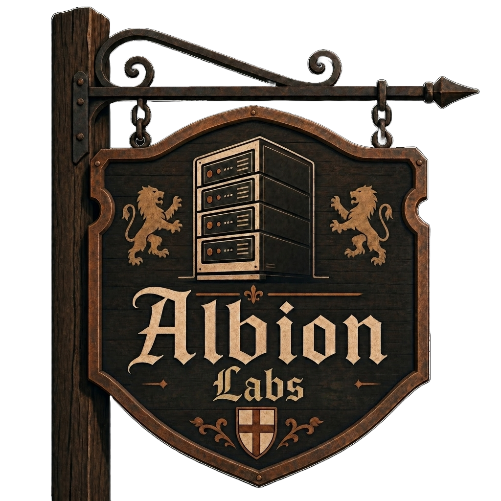

  
  <h1>Albion Labs</h1>

A personal homelab for self-hosting services, improving privacy/security,
and learning more about DevOps and infrastructure.

This lab is mainly a testing and learning environment where I experiment with
tools, deployments, virtualization, networking, and self-hosting.

## Networking Services
- **Tailscale** - VPN for secure remote access
- **NextDNS** - DNS-based ad blocking and security

## Homelab Services

### Infrastructure
- **Proxmox** - Virtualization platform for managing VMs and lab
  infrastructure
- **Caddy** - Reverse proxy for domains and subdomains with automatic HTTPS

### Management and Monitoring
- **Glance** - Dashboard and start page for news, monitoring, and quick links
- **Uptime Kuma** - Self-hosted uptime monitoring with notifications
- **Portainer** - Docker container visualization and management
- **Dozzle** - Docker container logging

### Media and Utilities
- **Jellyfin** - Self-hosted media server
- **MySpeed** - Self-hosted internet speed testing
- **Yt_Dlp** - Docker container to easily download YouTube videos with Yt_Dlp
  through a web interface

## To-Do

- [ ] **Nextcloud** - Self-hosted cloud storage and collaboration
- [ ] **Obsidian Sync** - Self-hosted note synchronization
- [ ] **HTTPS/TLS** - Enable HTTPS for most services
- [ ] **Sandbox Development VM** - Dedicated VM for testing and development
- [ ] **Proxmox High Availability** - Configure HA for better resilience
- [ ] **Kubernetes Playground** - Small cluster for learning and experimentation
